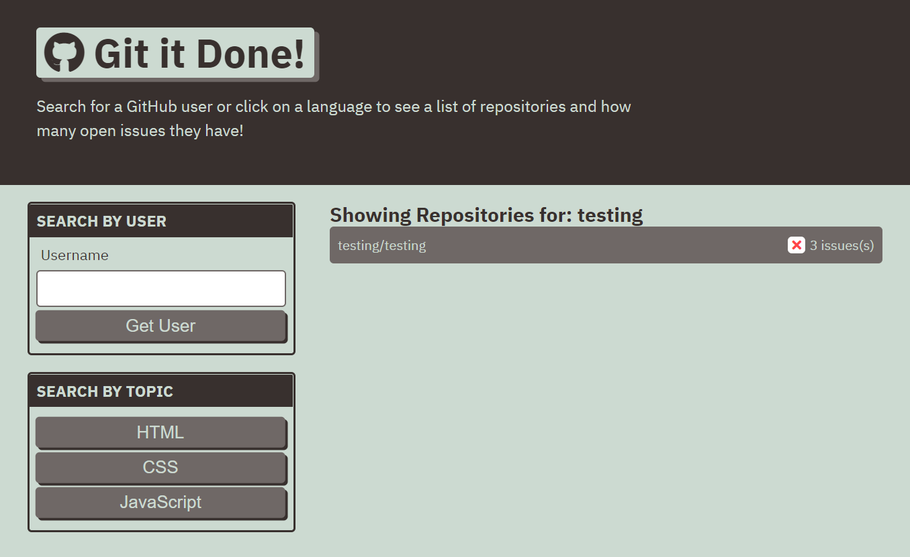

# Git It Done

## Description
Web application that allows users to view repositories when searching by user or preset topics.

Table of Contents |
-------------------|
[Usage](#Usage)
[Technologies](#Technologies)
[Screenshots](#Screenshots)
[Contributing](#Contributing)
[Author](#Author)
[Questions](#Questions)

 

## Usage

The website allows users to view the public repositories of a user or by the featured language of the repository. The search function queries the GitHub API and returns the repositories associated with the user or language selected along with any open issues of each repository. Clicking on a repository will redirect to a new page for the specific repository with a list of issues, upto 30 issues. Clicking on an issue will then take the user to the specific issue page.

You can find the deployed link and the repository link below:

Deployed Link: [Deployed Link](https://cerafinn.github.io/git-it-done)

Repo Link: [Repo Link](https://github.com/cerafinn/git-it-done)

 

## Technologies

* HTML
* CSS
* JavaScript
* GitHub API

 

## Screenshots

## Contributing

If interested in contributing to the project, feel free to reach out. Contact information can be found in the Questions section.

 

## Author

Andaleeb Farooq: [:octocat:](https://github.com/cerafinn)

 

## Questions

If you have any questions or issues, feel free to reach out at: andaleeb.farooq@gmail.com.
You can also find more of my work on Github at [github link](https://github.com/cerafinn).